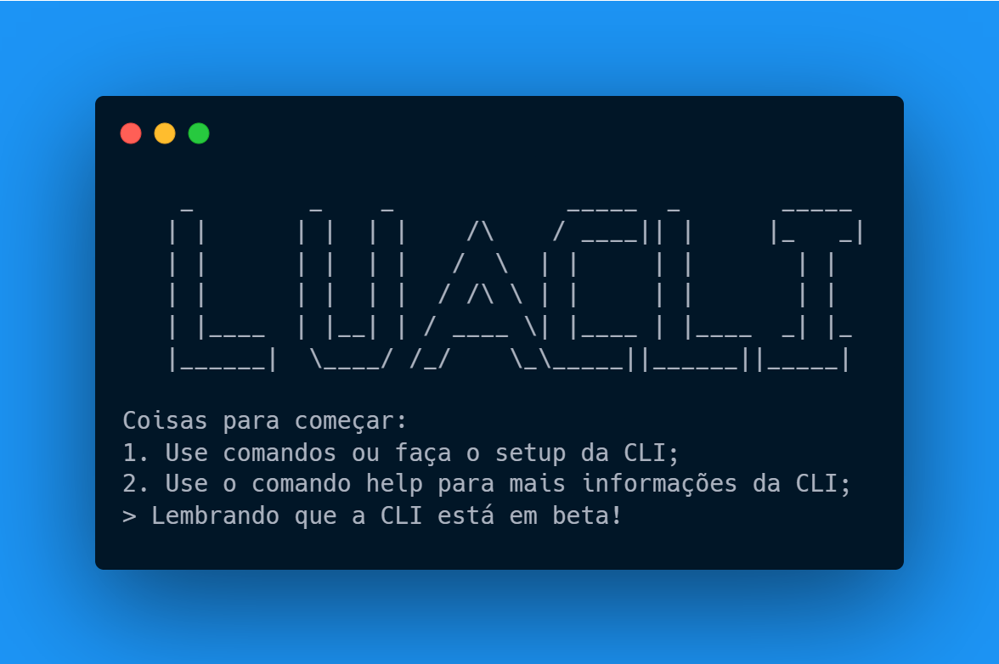

# 💻 LuaCLI

 
 

    

Uma CLI para ter informações da LuaBot no Seu Terminal!

## 🛠️ Comandos

- `bun run ./src/index.ts` - Roda o Arquivo Principal(Mostra o painel inicial);
- `bun run ./src/index.ts -s` - Roda o setup da CLI;
- `bun run ./src/index.ts --help` - Mostra informações sobre a CLI;

## 📦 Instalação
 1. Tenha o Bun instalado na sua máquina.
 2. Tenha o VS Code Instalado na sua máquina.
 3. Clone o repositório usando git clone. `Opcional`
 4. Rode o executável do seu sistema. `Opcional`

Feito com ❤️ por PerfectTea e Astro
